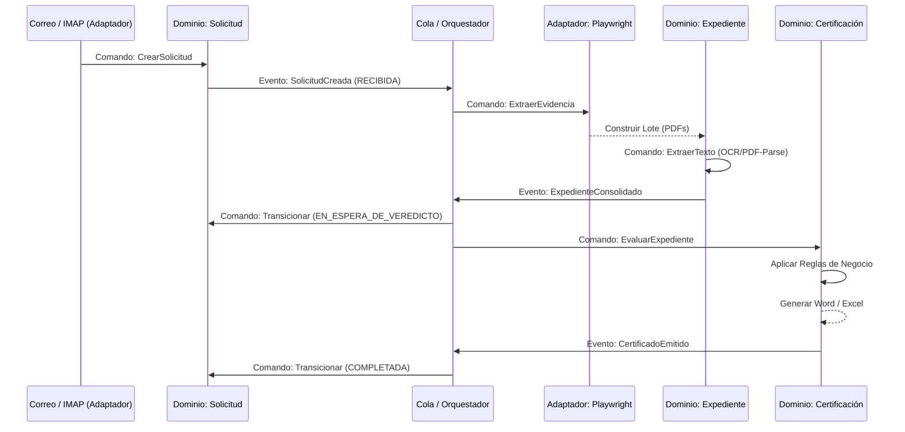
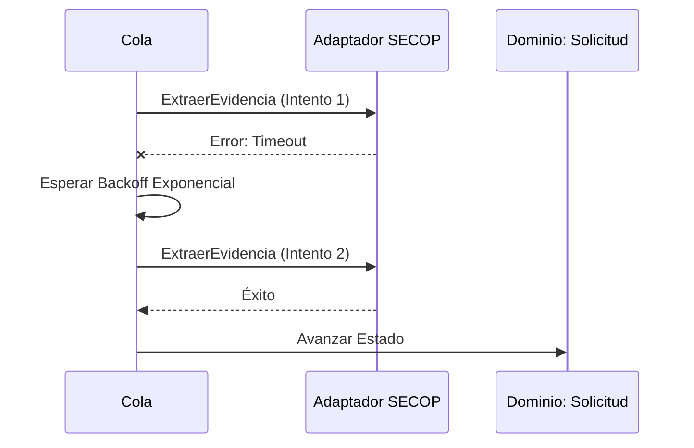
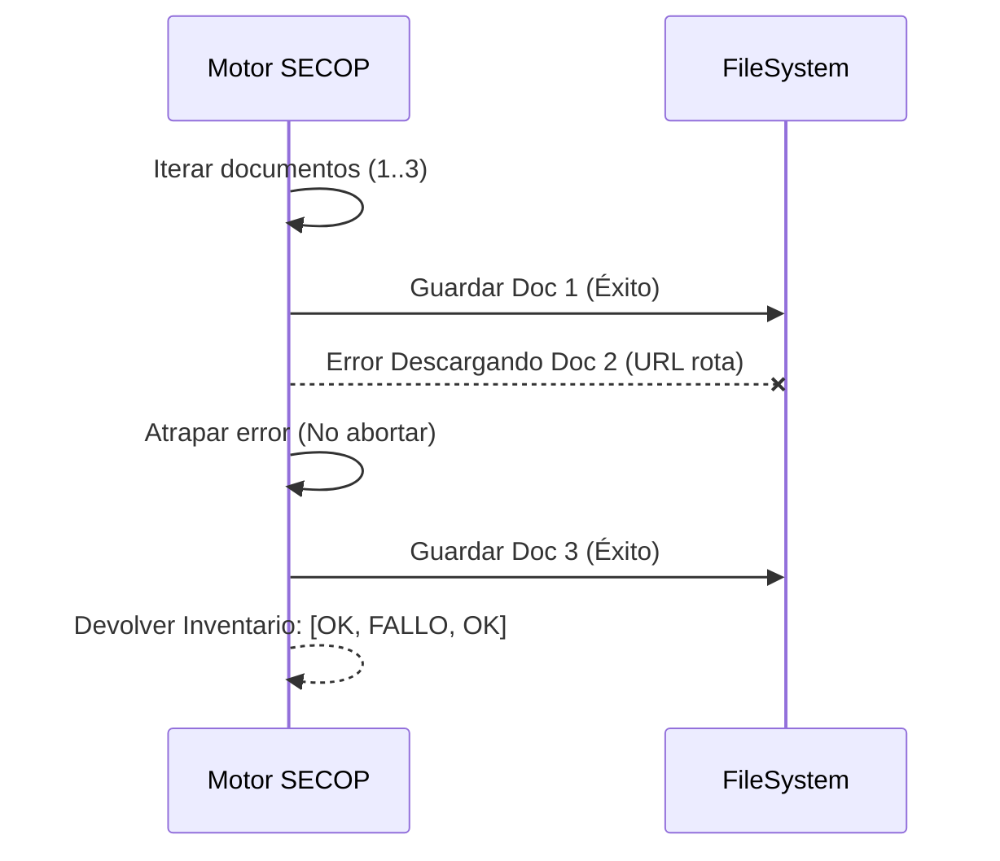
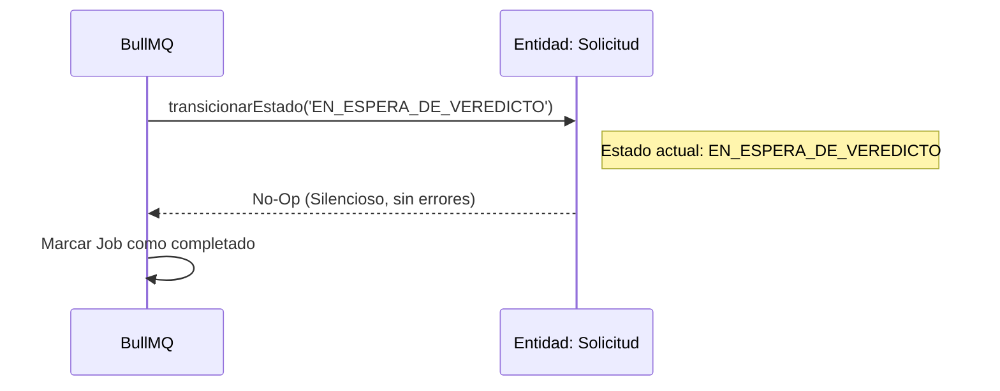
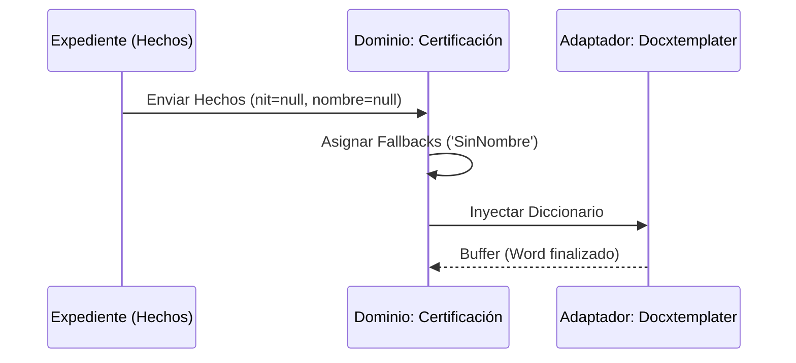

# 06 - Diagramas de Secuencia (Sequence Diagrams)

*Nota: Los diagramas Mermaid se procesan automáticamente en visualizadores de Markdown.*

### Caso 1: Flujo Completo Ideal (V2 Vision)

### Caso 2: Reintento por caída de red

### Caso 3: Fallo de descarga individual (Soft Batch Failure)

### Caso 4: Idempotencia

### Caso 5: Generación de Certificado (Defensiva)

