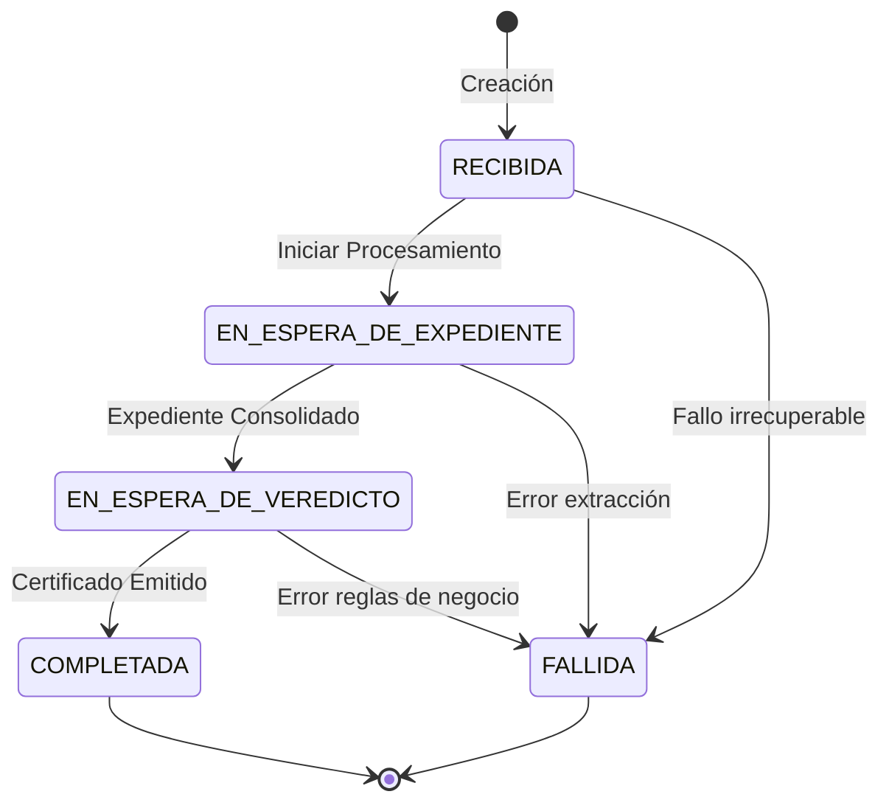
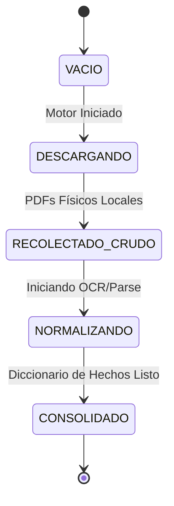
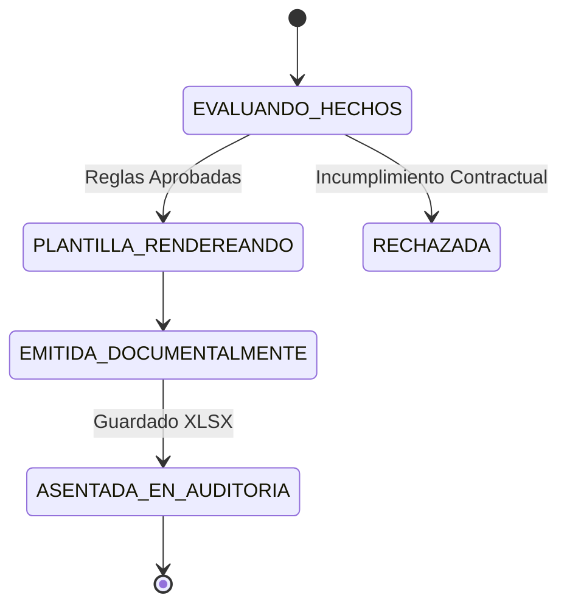

# 07 - Diagramas de Estado (State Diagrams)

### Ciclo de vida: Solicitud

```mermaid
stateDiagram-v2
    [*] --> RECIBIDA : Creación
    
    RECIBIDA --> EN_ESPERA_DE_EXPEDIENTE : Iniciar Procesamiento
    RECIBIDA --> FALLIDA : Fallo irrecuperable
    
    EN_ESPERA_DE_EXPEDIENTE --> EN_ESPERA_DE_VEREDICTO : Expediente Consolidado
    EN_ESPERA_DE_EXPEDIENTE --> FALLIDA : Error extracción
    
    EN_ESPERA_DE_VEREDICTO --> COMPLETADA : Certificado Emitido
    EN_ESPERA_DE_VEREDICTO --> FALLIDA : Error reglas de negocio
    
    COMPLETADA --> [*]
    FALLIDA --> [*]
```

### Ciclo de vida (Tentativo): Expediente SIA

```mermaid
stateDiagram-v2
    [*] --> VACIO
    VACIO --> DESCARGANDO : Motor Iniciado
    DESCARGANDO --> RECOLECTADO_CRUDO : PDFs Físicos Locales
    RECOLECTADO_CRUDO --> NORMALIZANDO : Iniciando OCR/Parse
    NORMALIZANDO --> CONSOLIDADO : Diccionario de Hechos Listo
    CONSOLIDADO --> [*]
```

### Ciclo de vida (Tentativo): Certificación

```mermaid
stateDiagram-v2
    [*] --> EVALUANDO_HECHOS
    EVALUANDO_HECHOS --> PLANTILLA_RENDEREANDO : Reglas Aprobadas
    EVALUANDO_HECHOS --> RECHAZADA : Incumplimiento Contractual
    PLANTILLA_RENDEREANDO --> EMITIDA_DOCUMENTALMENTE
    EMITIDA_DOCUMENTALMENTE --> ASENTADA_EN_AUDITORIA : Guardado XLSX
    ASENTADA_EN_AUDITORIA --> [*]
```
