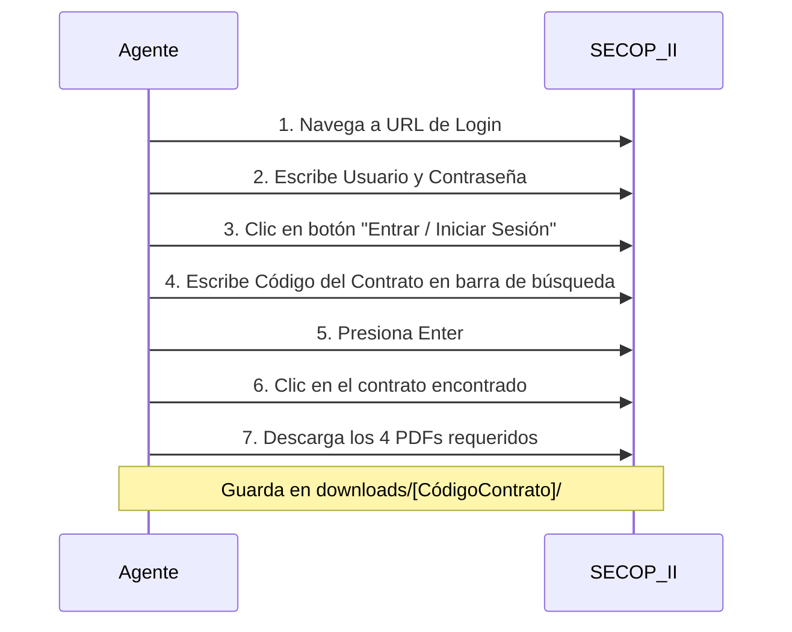
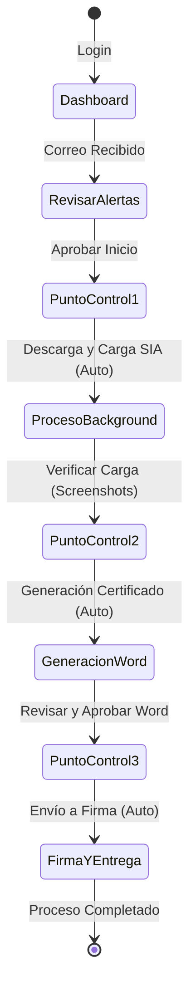

# Manual de Procedimiento y Guía de Operación: Agente SIA Observa

Este documento describe de manera detallada y paso a paso el funcionamiento, la estructura de archivos, los clics en plataformas externas (SECOP II y SIA Observa), el almacenamiento de documentos y la integración con la infraestructura de la Gobernación del Cauca.

---

## 1. Licenciamiento y Compatibilidad Tecnológica

### ¿Esta tecnología es libre y sin restricciones?
**Sí. Toda la pila propuesta es 100% Código Abierto (Open Source) bajo licencias permisivas (MIT y Apache 2.0).**
*   **Node.js**: Licencia MIT (gratuita, comercial y gubernamental sin costo).
*   **BullMQ / Redis**: Licencia MIT / BSD (gratuita para uso interno, colas empresariales sin coste).
*   **Playwright (Microsoft)**: Licencia Apache 2.0 (gratuita y de código abierto).
*   **Express / Next.js**: Licencia MIT.
*   **docxtemplater**: Licencia MIT para las funciones estándar de reemplazo de variables.

No existen costos de licenciamiento, restricciones de la auditoría de software, ni tarifas por volumen de transacciones o usuarios.

### Integración con Servidores Oracle de la Gobernación
Al contar con licenciamiento y servidores de **Oracle**, la arquitectura es totalmente compatible:
1.  **Base de Datos**: El agente utiliza inicialmente un motor liviano SQLite (`auditoria.db`). Esto se puede migrar a su base de datos **Oracle** reemplazando el módulo de base de datos (`database.js`) por el driver oficial de Node.js `oracledb`.
2.  **Oracle Linux / VM**: El despliegue en contenedores Docker funciona de forma idéntica y optimizada sobre servidores que ejecuten **Oracle Linux** o máquinas virtuales de su infraestructura.

---

## 2. Estructura de Carpetas del Proyecto

Los documentos, logs y configuraciones se organizan de la siguiente manera en el servidor:

```
/opt/sia-observa/
├── credentials/                 # Directorio de alta seguridad (No Git)
│   └── service-account.json     # Llave OAuth2 para Google Workspace (Gmail)
├── templates/                   # Plantillas institucionales editables
│   ├── plantilla_persona_natural.docx
│   └── plantilla_persona_juridica.docx
├── storage/                     # Almacenamiento persistente del Agente
│   ├── auditoria.db             # Base de datos SQLite (solicitudes, eventos)
│   ├── certificados.xlsx        # Libro de Excel consolidado de firmas
│   ├── certificados/            # Carpeta con certificados .docx generados
│   └── logs/                    # Bitácoras de sistema
│       ├── combined.log         # Logs generales
│       └── error.log            # Logs de fallas críticas
├── downloads/                   # Almacenamiento temporal de descargas
│   └── [CódigoContrato]/        # Subcarpeta temporal por contrato
│       ├── [Contrato]_Supervisor.pdf
│       ├── [Contrato]_Contratista.pdf
│       ├── [Contrato]_Pago.pdf
│       └── [Contrato]_Contrato.pdf
└── screenshots/                 # Capturas de pantalla de evidencia (SIA Observa)
    ├── sia_login_[Contrato].png
    ├── sia_carga_[Contrato]_informe_supervisor.png
    └── sia_final_[Contrato].png
```

---

## 3. Flujo Paso a Paso de la Automatización (Los Clics del Agente)

A continuación, se describen las acciones exactas que realiza el agente autónomo en cada plataforma.

### Paso 1: Recepción de Solicitud (Google Workspace)
*   **Frecuencia**: Cada 5 minutos de forma autónoma.
*   **Acción del Agente**:
    1. Llama a la API de Gmail utilizando OAuth2 (sin contraseñas planas).
    2. Busca correos no leídos que contengan en el asunto: `"certificado"` o `"SIA Observa"`.
    3. Lee el cuerpo del correo y con IA (OpenAI GPT-4o) extrae:
        *   Código de Contrato
        *   Nombre del Contratista
        *   Número de Pago / Acta
        *   Correo de respuesta
    4. Registra la solicitud en `storage/auditoria.db` en estado `pendiente_aprobacion`.
    5. Envía un correo automático de notificación al supervisor.
    6. **Punto de Control 1**: El agente se detiene y espera a que el supervisor pulse "Aprobar" en el dashboard.

---

### Paso 2: Descarga desde SECOP II (Playwright)
Una vez aprobado el paso anterior, el contenedor `sia-workers` inicia un navegador virtual (Chromium) en segundo plano y realiza el siguiente recorrido:



*   **Los documentos descargados son**:
    1.  *Informe del Supervisor*
    2.  *Informe del Contratista*
    3.  *Comprobante de Egreso (Pago)*
    4.  *Contrato o Clausulado*

---

### Paso 3: Validación y Compresión de PDFs
*   **Acción del Agente**:
    1. Examina el tamaño de los 4 archivos descargados en la carpeta `downloads/[CódigoContrato]/`.
    2. Si alguno supera los **4.0 MB**, invoca a **Ghostscript** de forma interna ejecutando:
       `gs -sDEVICE=pdfwrite -dCompatibilityLevel=1.4 -dPDFSETTINGS=/ebook -dNOPAUSE -dBATCH -sOutputFile=[Salida] [Original]`
    3. Si el archivo se comprime a menos de 4 MB conservando su legibilidad, reemplaza al original.
    4. Si tras tres niveles de compresión (`ebook`, `screen`, `printer`) sigue pesando más de 4 MB, detiene el proceso y cambia el estado de la solicitud en la base de datos a `requiere_reescaneo`, enviando un correo al contratista/supervisor para que lo digitalicen en menor resolución.

---

### Paso 4: Carga de Documentos en SIA Observa (Playwright)
El worker inicia navegación en SIA Observa:

1.  **Login**:
    *   Navega a la URL institucional de SIA Observa.
    *   Escribe el usuario (ej: `gerson.orozco@cauca.gov.co`) y contraseña en los campos respectivos.
    *   Hace clic en **"Ingresar"** o **"Aceptar"**.
2.  **Búsqueda del Contrato**:
    *   Hace clic en el menú **"Buscar - Contratos"**.
    *   Escribe el código del contrato en el campo de texto.
    *   Hace clic en el botón **"Consultar contratos que cumplan parámetros"**.
    *   En la tabla de resultados, hace clic en el icono de la **Lupa** para abrir los detalles.
    *   Si se despliega un mensaje emergente de alerta del navegador, hace clic en **"OK / Aceptar"**.
3.  **Anexar los Archivos**:
    *   Hace clic en la pestaña **"Documentos de Legalidad Anexados"**.
    *   Para cada uno de los 4 archivos descargados, realiza la siguiente secuencia de clics:
        *   Hace clic en **"Anexar documentos"**.
        *   En el selector *Etapa de Contratación*, elige: **"Contractual"**.
        *   En el selector *Fase de Contratación*, elige: **"En ejecución"**.
        *   En el selector *Documento*, elige la categoría correspondiente:
            *   *INFORMES DE SUPERVISIÓN / INTERVENTORÍA(AGR)* (Para el informe de supervisión).
            *   *INFORMES POR PARTE DEL CONTRATISTA* (Para el informe del contratista).
            *   *PAGOS REALIZADOS (AGR)* (Para el comprobante de pago).
            *   *FACTURAS O CUENTAS DE COBRO(AGR)* (Sube el informe del contratista nuevamente, según el procedimiento).
        *   Hace clic en el botón **"Examinar/Seleccionar archivo"** y carga el PDF desde `downloads/[CódigoContrato]/`.
        *   Hace clic en **"Insertar anexo"**.
        *   **El Agente toma un Screenshot** de confirmación y lo guarda en `screenshots/sia_carga_[Contrato]_[Tipo].png`.
4.  **Punto de Control 2**: El agente sube las evidencias visuales y cambia el estado a `pendiente_verificacion_carga`. El supervisor puede verificar las capturas en el dashboard.

---

### Paso 5: Generación del Certificado
1.  **Lectura del Clausulado**:
    *   El agente extrae el texto del documento del contrato PDF.
    *   La IA clasifica el contrato: **Persona Natural** o **Persona Jurídica**.
2.  **Extracción con IA**:
    *   *Persona Natural*: Extrae Código de contrato, proceso, nombre, cédula y lugar de expedición.
    *   *Persona Jurídica*: Extrae Código de contrato, proceso, Nombre de la Empresa, NIT, Representante Legal, Cédula del Representante y expedición.
3.  **Llenado de Documentos**:
    *   Abre la plantilla correspondiente en la carpeta `templates/` (`plantilla_persona_natural.docx` o `plantilla_persona_juridica.docx`).
    *   Reemplaza los campos dinámicos `{{nombre}}`, `{{cedula}}`, `{{pago}}`, etc.
    *   Guarda el nuevo archivo Word en `storage/certificados/` con el nombre estructurado:
        `[CódigoContrato] - [NombreContratista] - Pago [NumeroPago].docx`
4.  **Registro de Control**:
    *   Agrega una nueva fila al final del archivo de Excel `storage/certificados.xlsx` con toda la información extraída, la fecha de generación y el funcionario asignado.
5.  **Punto de Control 3 (Crítico)**: Envía el Word generado al dashboard en estado `pendiente_revision_certificado`. El supervisor debe verificar la redacción y oprimir **"Aprobar"** para despachar.

---

### Paso 6: Envío y Entrega Final
*   **Envío para firma**:
    1. Toma el archivo `.docx` aprobado y lo adjunta en un correo electrónico enviado a `siadepartamento@cauca.gov.co`.
    2. Cambia el estado a `enviado_firma`.
*   **Recepción y Entrega**:
    1. El agente monitorea la bandeja de entrada esperando la respuesta firmada de `siadepartamento@cauca.gov.co`.
    2. Cuando detecta el correo de respuesta con el certificado en formato PDF firmado, lo descarga.
    3. Envía un correo de entrega al contratista original con el PDF firmado adjunto.
    4. Cambia el estado en la base de datos a `finalizado`.

---

## 4. Guía de Operación para el Supervisor

El supervisor tiene acceso al Dashboard web premium a través del puerto asignado (por ejemplo, `http://localhost:4000` o la IP interna asignada al servidor).

### Flujo de Trabajo Diario del Supervisor:



### Detalle de los Controles del Dashboard

*   **Pantalla de Inicio**: Muestra contadores en tiempo real (Total, Pendientes, En Proceso, Completadas, Errores).
*   **Aprobación Inicial (Punto de Control 1)**:
    *   Aparecerá en la pestaña "Pendientes".
    *   Muestra los datos extraídos del correo del contratista.
    *   Clic en **"Aprobar"** para autorizar al robot a conectarse a SECOP II y SIA Observa.
*   **Verificación de Carga (Punto de Control 2)**:
    *   Se muestra cuando el robot termina de cargar los PDFs en SIA Observa.
    *   Permite ver la galería de capturas de pantalla de la plataforma SIA Observa para constatar visualmente que los archivos estén en su sitio.
    *   Clic en **"Confirmar Carga"**.
*   **Revisión del Certificado (Punto de Control 3)**:
    *   Muestra los campos que se incrustaron en el Word.
    *   Permite descargar el archivo `.docx` generado para abrirlo y validarlo.
    *   Si los datos son correctos, clic en **"Aprobar y Enviar a Firma"**. Si hay algún error, el supervisor puede corregir el campo directamente en pantalla y hacer clic en **"Regenerar"**.
