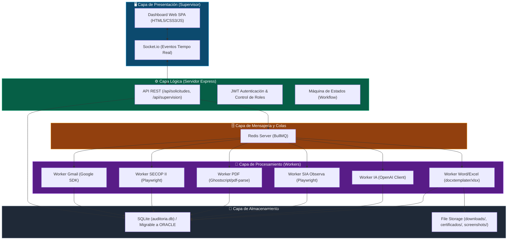
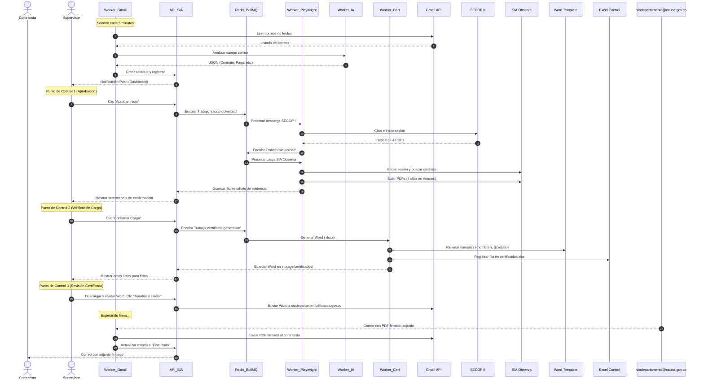

# Plan de Trabajo Oficial: Agente de Automatización SIA Observa
**Gobernación del Cauca — Subdirección de Infraestructura Tecnológica**

Este documento detalla la planificación, arquitectura, componentes y secuencia para el despliegue del agente autónomo de certificados SIA Observa por parte del equipo de TI.

---

## 📸 Muestra del Dashboard de Supervisión (Mockup)

A continuación se muestra el diseño premium en modo oscuro implementado para el panel de supervisión web del agente:


---

## 1. Arquitectura de Componentes

El agente se organiza en un esquema desacoplado y modular para garantizar que el procesamiento pesado de navegadores web (Playwright) no afecte la disponibilidad de la interfaz del supervisor:



---

## 2. Diagrama de Secuencia (Flujo del Proceso)

El siguiente diagrama ilustra el flujo de datos y las llamadas entre módulos desde que llega un correo electrónico de solicitud hasta que el certificado firmado se entrega al contratista:



---

## 3. Casos de Uso del Negocio

### CU-01: Recepción e Inicio de Solicitud
*   **Actor**: Contratista (Remitente) y Supervisor (Aprobador).
*   **Flujo**:
    1.  El contratista envía un correo a `sia.educacion@cauca.gov.co` solicitando su certificado SIA Observa de un pago específico.
    2.  El agente extrae la información y notifica al supervisor en el Dashboard.
    3.  El supervisor ingresa al Dashboard, revisa la información de la solicitud (Nombre, contrato y pago) y hace clic en **"Aprobar"**.
*   **Resultado**: La solicitud pasa a la cola de procesamiento en Redis.

### CU-02: Procesamiento y Carga Automática
*   **Actor**: Agente (Bot Playwright).
*   **Flujo**:
    1.  El bot inicia sesión en SECOP II y descarga: Informe de Supervisor, Informe de Contratista, Comprobante de Pago y Contrato.
    2.  El bot valida y comprime los PDFs a menos de 4.0 MB.
    3.  El bot inicia sesión en SIA Observa, navega al contrato del contratista, adjunta los 4 documentos y guarda capturas de pantalla de evidencia.
*   **Resultado**: El supervisor puede ver en el Dashboard las screenshots de los documentos ya cargados en la base de datos de SIA Observa.

### CU-03: Generación y Envío a Firma
*   **Actor**: Supervisor y Funcionario.
*   **Flujo**:
    1.  El bot extrae los datos del PDF del contrato usando IA.
    2.  El bot llena la plantilla DOCX institucional y agrega una fila en el Excel de control.
    3.  El supervisor descarga el Word generado desde el Dashboard, revisa la redacción y hace clic en **"Aprobar y Enviar a Firma"**.
    4.  El bot envía el correo de solicitud de firma a `siadepartamento@cauca.gov.co`.
*   **Resultado**: El proceso queda a la espera del correo firmado para entregárselo al contratista.

---

## 4. Plan de Trabajo por Semanas (Asignación de Tareas)

Este plan de trabajo estima una duración de **6 semanas** de implementación utilizando los componentes técnicos ya creados en el repositorio.

```
Cronograma General de Trabajo:
[S1: Infraestructura] ▬▬▬►
  [S2: OAuth2 / Gmail API] ▬▬▬►
    [S3: Flujos Playwright] ▬▬▬►
      [S4: Plantillas & Excel] ▬▬▬►
        [S5: Dashboard & Sockets] ▬▬▬►
          [S6: Pruebas & Rollout] ▬▬▬► 🟢 PRODUCCIÓN
```

### 📅 Semana 1: Configuración de Infraestructura (Responsable: Ingeniero de Servidores / TI)
*   **Tarea 1.1**: Levantar el servidor virtual (VM) con Ubuntu 22.04 LTS o su sistema operativo de servidor actual.
*   **Tarea 1.2**: Instalar Docker y Docker Compose en la máquina virtual.
*   **Tarea 1.3**: Levantar los contenedores del proyecto utilizando el archivo [docker-compose.yml](file:///c:/Users/jefes/OneDrive/Desktop/SISE%202026/01_INFRAESTRUCTURA%20TECNOLOGICA%2040%25/Automatizacion%20SIA/docker-compose.yml) (`docker compose up -d`).
*   **Tarea 1.4**: Configurar la IP fija del servidor y habilitar puertos en el firewall (UFW) de la gobernación (Puertos: 80, 443).

### 📅 Semana 2: Integración de Google Workspace (Responsable: Administrador de Google Workspace / Seguridad)
*   **Tarea 2.1**: Crear un proyecto en Google Cloud Console asociado al tenant de la Gobernación del Cauca.
*   **Tarea 2.2**: Habilitar la Gmail API y crear una **Service Account (Cuenta de Servicio)**. Descargar la clave privada en formato JSON.
*   **Tarea 2.3**: En la Consola de Administración de Google Workspace, configurar la **Domain-wide Delegation (Delegación a nivel de dominio)** para la cuenta de servicio, otorgándole permisos para actuar en nombre de la cuenta `sia.educacion@cauca.gov.co`.
*   **Tarea 2.4**: Guardar el archivo JSON de clave privada en la carpeta `credentials/service-account.json` del agente.

### 📅 Semana 3: Calibración de Automatización Playwright (Responsable: Desarrollador Backend)
*   **Tarea 3.1**: Modificar las credenciales reales de acceso para SECOP II y SIA Observa en el archivo `.env`.
*   **Tarea 3.2**: Ejecutar en modo desarrollo el script de descarga de SECOP II (`npm run secop:download`) para verificar que el selector de Playwright encuentre correctamente los archivos.
*   **Tarea 3.3**: Ejecutar el script de carga en SIA Observa (`npm run sia:upload`) y validar que cargue los archivos en la etapa *Contractual* y fase *En ejecución*. Ajustar los selectores CSS si las plataformas hicieron actualizaciones de UI recientes.
*   **Tarea 3.4**: Configurar la ruta e instalación de **Ghostscript** para garantizar que los comandos de compresión PDF funcionen sin problemas.

### 📅 Semana 4: Diseño de Plantillas y Almacenamiento (Responsable: Líder Funcional de Negocio)
*   **Tarea 4.1**: Revisar las plantillas institucionales oficiales de Word para Persona Natural y Persona Jurídica.
*   **Tarea 4.2**: Reemplazar los textos estáticos por variables encerradas entre llaves dobles (ejemplo: `{{nombre}}`, `{{cedula}}`, `{{pago}}`, `{{fecha}}`).
*   **Tarea 4.3**: Guardar los archivos de plantilla resultantes en la carpeta `templates/` con los nombres:
    *   `plantilla_persona_natural.docx`
    *   `plantilla_persona_juridica.docx`
*   **Tarea 4.4**: Verificar la creación automática de la base de datos `storage/auditoria.db` y el archivo Excel consolidado de firmas `storage/certificados.xlsx`.

### 📅 Semana 5: Integración del Dashboard y WebSockets (Responsable: Desarrollador Frontend)
*   **Tarea 5.1**: Integrar la autenticación basada en JWT para supervisores de la Gobernación.
*   **Tarea 5.2**: Validar que Socket.io envíe eventos en tiempo real al panel cuando el robot cambie de estado (por ejemplo, de "descargando" a "carga completada").
*   **Tarea 5.3**: Habilitar el módulo de colas en el Dashboard para permitir que los administradores reintenten trabajos fallidos desde la interfaz.
*   **Tarea 5.4**: Proteger el dashboard utilizando un certificado SSL (Nginx Reverse Proxy) para que las credenciales viajen de forma segura a través de HTTPS.

### 📅 Semana 6: Pruebas Piloto y Rollout (Responsable: Todo el Equipo / Supervisores)
*   **Tarea 6.1**: Realizar pruebas end-to-end simulando 5 solicitudes reales de contratistas vía correo electrónico.
*   **Tarea 6.2**: Validar que los 3 puntos de supervisión funcionen correctamente y que los archivos DOCX se generen sin errores de renderizado.
*   **Tarea 6.3**: Capacitar al equipo de supervisores (Gerson Orozco y equipo de apoyo) en el uso del Dashboard.
*   **Tarea 6.4**: Desplegar a producción y activar el servicio systemd (`sudo systemctl start sia-observa`).

---

## 5. Instrucciones para la Integración con Oracle Database

Si el equipo de TI de la Gobernación prefiere utilizar sus servidores y bases de datos **Oracle** corporativas licenciadas en lugar del almacenamiento SQLite local, el desarrollador backend debe seguir estos pasos:

1.  **Instalar el Driver**:
    ```bash
    npm install oracledb
    ```
2.  **Modificar el archivo** `src/config/database.js`:
    Reemplazar la inicialización de SQLite con la conexión a su servidor Oracle:
    ```javascript
    const oracledb = require('oracledb');
    
    async function initDatabase() {
      await oracledb.createPool({
        user: process.env.ORACLE_USER,
        password: process.env.ORACLE_PASSWORD,
        connectString: "IP_SERVIDOR_ORACLE:PORT/SERVICE_NAME"
      });
      console.log("Conectado a la base de datos Oracle licenciada");
    }
    ```
3.  **Adaptar los queries**: Cambiar la sintaxis SQL de mejor rendimiento SQLite a Oracle SQL en las funciones de CRUD (`crear`, `obtener`, `actualizarEstado`).
